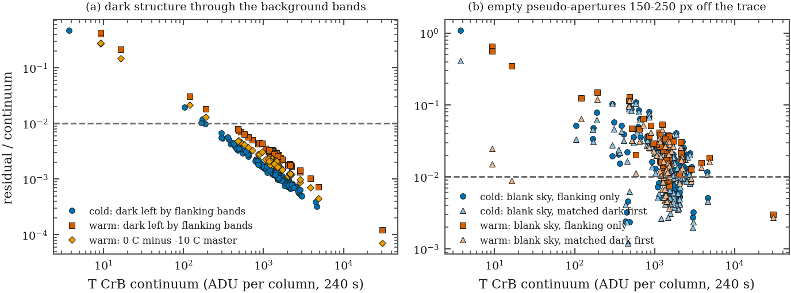

# TCRB-P0-temp-split / -calib-acquisition — the grism frames by detector temperature

Generated by `pipeline/scripts/run_tcrb.py` at 2026-10-05T06:36:47Z (git b89290c); do not edit.

Tables `tcrb_temp_split` (per frame), `tcrb_temp_summary`, `tcrb_dark_masters` in `products/tcrb/tcrb.sqlite`; groups by `p0.temp_group` (cold <= -7.5 C, warm >= -5 C). Frames without a library trace (G v2 `no_trace`) are counted but not measured.

| group | CCD-TEMP (C) | frames | traced | dark master (2025, epoch ASI:2024-12-16) | dark left by flanking, median ADU/col | ... as fraction of continuum, median | unmasked hot px in aperture per frame |
|---|---|---|---|---|---|---|---|
| cold | -10.3 .. -9.7 | 167 | 145 | -10 C, 2025-01-05 (128 s, 512 s) | 1.73 | 0.0012 | 65 |
| warm | -1.5 .. 0.3 | 80 | 64 | 0 C, 2025-04-14 (128 s, 512 s) | 3.83 | 0.0028 | 288 |

Blank-sky pseudo-apertures (median |residual| / continuum): cold 0.0144 flanking-only, 0.0127 with the matched dark subtracted first; warm 0.0207 and 0.0147. Using the -10 C master on a 0 C frame would leave a further 0.0020 (median).

## Method (the paragraph TCRB-P0-calib-acquisition asks for)

The 247 T CrB grism frames of 2025 (240 s, Mode0, 2x2 average) split cleanly by CCD-TEMP: 167 at the -10 C set point and 80 at the 0 C set point used from 2025-04-14; none lies between. Contrary to the premise of DE.F5, both temperatures have matched master darks from the same mechanical epoch (-10 C on 2025-01-05, 0 C on 2025-04-14; 128 s and 512 s, interpolated to 240 s). The archive's only 240 s master (2025-11-22) belongs to the next epoch (camera turned 180 deg, FLIPSTAT changed) and is never applied. The adopted treatment is the grism library's: no dark frame is subtracted; the per-column background from the two flanking bands (30-60 px either side of the trace, a straight line through their medians) removes sky, halo and dark together, and bad pixels are masked (S2 mask ASI_4788x3194_T-10_FM). What that leaves of the dark is measured, not assumed: each frame's temperature-matched 240 s master is passed through the identical aperture-minus-flanking operator at that frame's trace, and the result, divided by the frame's own continuum, is carried as a per-frame fractional EW penalty (an additive background error b biases EW by -b/C). Warm frames carry a penalty 2.4x the cold frames' (medians 0.0028 and 0.0012) and about 4.4x as many hot pixels the -10 C mask does not hold; those are removed by the extraction's outlier rejection, and the warm frames are flagged so every EW result can be checked with them excluded. Blank-sky pseudo-apertures show that the flanking-band residual is dominated by sky structure, not dark (panel b): subtracting the matched dark first changes it by 0.0017 (cold) and 0.0060 (warm) of the continuum. New Mode0 darks cannot be taken on the camera now mounted (QHY600): whether the ASI survives and can be cooled on a bench is question 1 of section 8 of the rev. 3 observatory request (`ops/2026-10_observatory_request_rev3.md`).

