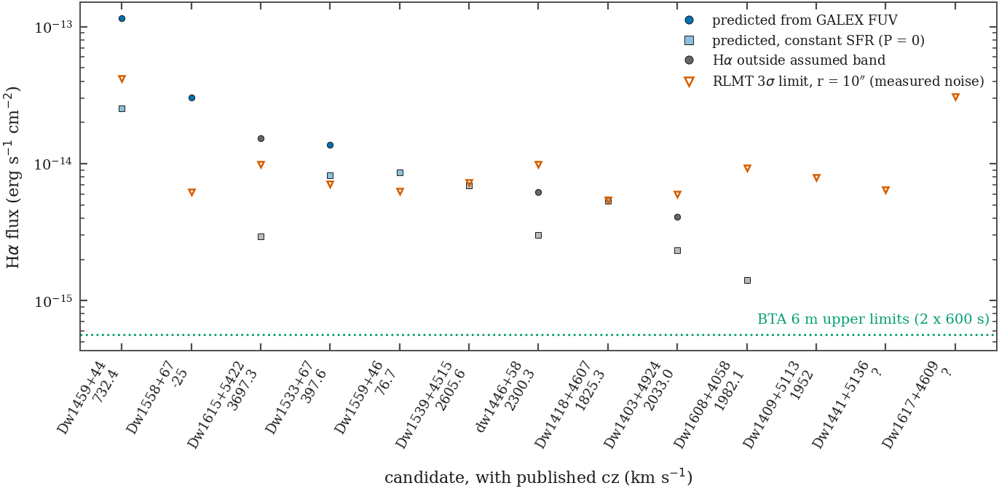

# Package `novelty-dwarf` — REPORT (DW-N1, DW-P36-0 inputs)

2026-10-03. Owner of `DwarfGalaxy_AGN_Survey/notes/novelty/` and this directory. Nothing else was edited;
the manifest was opened `mode=ro`; the archive was only read; no git state was touched.

Every number below is emitted by `DwarfGalaxy_AGN_Survey/notes/novelty/build_dwarf_novelty.py` into
`notes/novelty/out/` (CSV canonical, `NOVELTY_TABLE.md` the readable rendering). Literature values enter only
through `literature_status.csv`, each with a key resolved in `references.csv`, whose last column says how I
verified the reference (source read / abstract only / not opened).

## 1. Headline

1. **The strategy's parent-catalogue attribution is wrong.** None of the 19 fields is in Karachentsev & Kaisina
   2022 (arXiv:2210.11070; its Table 2 has no entry between RA 13h33m and 22h15m), and arXiv:2501.07912 is a
   *southern* search. The fields are targets of **GBT project 23B-032 (P.I. Cannon)**, published as
   **Nazarova, Cannon, Karachentsev et al. 2025, AJ 170, 23 ("100 Proof", arXiv:2505.19248)**. The RLMT imaging
   (June–July 2023) is the optical companion to an HI programme whose results are already in print.
2. **17 of 19 candidates are already classified** — a published radial velocity (15 HI, 2 optical BTA), hence a
   kinematic distance. Only **5 are in the Local Volume** (D < 12 Mpc); 12 are background field dwarfs at
   14–57 Mpc; one of those (Dw1615+5422) is "a peculiar spiral or an interacting binary system", one
   (Dw1409+5113 = UGC 9050-Dw1) has its own HST+VLA paper (Fielder et al. 2023).
3. **DW-N1 gate: STOP as scoped.** "If most are already classified, stop" is met (17/19). What survives is not a
   candidate-vetting paper: it is integrated Hα fluxes for at most **four** already-known emission-line dwarfs
   (1 informative, 3 marginal at our depth), plus two unclassified fields where only a *detection* would say
   anything. No Hα flux is published for any of the 19 (LVGDB snapshot, 2026-10-03), so those four numbers
   would be new — a table, not a paper.
4. **The physicist's depth arithmetic holds** (measured, not assumed): 3σ = 7.2×10⁻¹⁵ erg s⁻¹ cm⁻² for
   7×512 s in r = 10″ against his ~10⁻¹⁴; 13× shallower than the BTA limits (range over fields 10–74×). But
   the white-noise calculation is **optimistic by a measured factor 1.56** (aperture-scale noise), and the
   depth question is secondary to a bigger one he could not have known: **7 of the 13 Hα fields have published
   velocities that put Hα outside a 65 Å filter centred at rest.**
5. **NGC 5548:** Xi et al. 2025 covers January–June 2023 at 1.9 d cadence but **does not measure Hα**
   (λ > 6200 Å excluded for second-order contamination). A slitless broad-Hα series is therefore not
   duplicated in print, but the same group has published the correction that lets them do it from spectra in
   hand; it is a paragraph, not a section (consistent with DW-P4x as a two-day triage).

## 2. What I did

| Step | Command (`build_dwarf_novelty.py …`) | Output |
|---|---|---|
| Census of every Dw field, NGC 5238, NGC 5548 from `frames` (`is_canonical=1`, Light, no error) | `census` | `out/field_census.csv`, `out/ngc5548_slot6_nights.csv` |
| Literature: read the arXiv LaTeX sources of the six relevant papers; transcribed per-candidate rows | — | `literature_status.csv`, `references.csv`, `ngc5548_2023_campaigns.csv` |
| Machine-read sources: LVGDB object pages (12), GALEX AIS 30″ cones (19), NED 15″ cones (19) | `fetch` | `sources/` (dated) |
| Sky noise in all 89 Hα frames, at the candidate's pixel, from the archive | `measure` | `out/halpha_frame_noise.csv` |
| Join, predictions, limits, verdicts, gate | `table` | `out/novelty_table.csv`, `out/physicist_depth_check.csv`, `out/predictor_validation.csv`, `out/gate_summary.csv`, `out/NOVELTY_TABLE.md` |
| Figure (house style, `plotstyle`) | `figure` | `out/fig_dw_halpha_depth.{png,pdf}` |
| Tests (26, all pass; no archive or manifest needed) | `pytest …/test_dwarf_novelty.py` | — |

Verdict rules were written into the script's docstring and `ha_verdict()` before the table was built.

## 3. Evidence

### 3.1 Census and classification (`out/novelty_table.csv`)

| field | catalogue name | L/R/H frames | Hα exp (h) | first listing | cz (km/s) | D (Mpc) | M_B | emission spectrum | association (literature) |
|---|---|---|---|---|---|---|---|---|---|
| Dw1403+49 | Dw1403+4924 | 27/13/11 | 1.56 | Nazarova+25 | 2033.0 | 32.2 | −13.6 | — | 16′ from NGC 5448 (2016 km/s) |
| Dw1409+51 | Dw1409+5113 = UGC 9050-Dw1 | 26/11/10 | 1.42 | KKK23 | 1952 | 31.6 | −13.6 | — | companion of UGC 9050; HST+VLA (Fielder+23) |
| Dw1418+46 | Dw1418+4607 | 26/7/10 | 1.42 | Nazarova+25 | 1825.3 | 28.6 | −14.1 | — | isolated BCD |
| Dw1441+51 | Dw1441+5136 | 23/7/8 | 1.14 | Nazarova+25 | **none** | — | — | — | GBT non-detection |
| Dw1446+58 | dw1446+58 | 22/5/6 | 0.85 | Müller+17 | 2300.3 | 36.8 | −14.1 | — | NGC 5777 group (was M 101 candidate) |
| Dw1459+44 | Dw1459+44 | 21/7/5 | 0.71 | KKKK24 | 732.4 | 14.5 | −14.8 | SDSS | 16′ W of UGC 9660 |
| Dw1533+67 | Dw1533+67 | 21/5/8 | 1.14 | KKKK24 | 397.6 | **10.1** | −12.6 | — | isolated dIrr |
| Dw1539+45 | Dw1539+4515 | 17/7/6 | 0.85 | Nazarova+25 | 2605.6 | 40.3 | −15.1 | — | isolated dIrr |
| Dw1558+67 | Dw1558+67 | 14/7/5 | 0.71 | KCK25 | −25 (BTA) | **3.1** | −10.8 | BTA | Local Void, near side |
| Dw1559+46 | Dw1559+46 | 14/7/7 | 1.00 | KKKK24 | 76.7 | **3.3** | −10.5 | BTA | Local Void, near side |
| Dw1608+40 | Dw1608+4058 | 14/6/4 | 0.57 | Nazarova+25 | 1982.1 | 30.9 | −13.6 | — | UGC 10200 group? |
| Dw1615+54 | Dw1615+5422 | 13/3/7 | 1.00 | Nazarova+25 | 3697.3 | 57.1 | −15.7 | — | not a dwarf; DESI z = 0.06 object 3″ away (NED) |
| Dw1617+46 | Dw1617+4609 | 14/2/2 | 0.28 | Nazarova+25 | **none** | — | — | — | GBT non-detection |
| Dw1633+69 | Dw1633+6906 | 13/0/0 | 0 | Nazarova+25 | 1122.9 | 19.6 | −13.5 | — | — |
| Dw1643+07 | Dw1643+0749 | 11/0/0 | 0 | Nazarova+25 | 1434.6 | 19.6 | −12.6 | — | — |
| Dw1645+46 | Dw1645+46 | 12/0/0 | 0 | KKKK24 | −21 (BTA) | **2.9** | −9.8 | BTA | Local Void, near side |
| Dw1709+74 | Dw1709+74 | 13/0/0 | 0 | KKKK24 | 1325.4 | 21.8 | −14.7 | BTA | "probably distant" at discovery |
| Dw1721+71 | Dw1721+7140 | 11/0/0 | 0 | Nazarova+25 | 1076.1 | 18.6 | −14.1 | — | — |
| Dw1735+57 | Dw1735+57 | 11/0/0 | 0 | KKKK24 | 42.9 | **4.4** | −11.7 | BTA (their Fig. 1) | Local Void, near side |

NGC 5238 (`out/field_census.csv`): G 88 / H 68 / L 64 / O 129 / R 78 / W 47 / X 70 frames on 15–21 nights,
2023-02-23 → 06-03; Hα exposure 9.67 h. LVGDB: TRGB 4.51 Mpc, published F(Hα) = (5.50 ± 0.81)×10⁻¹³.
NGC 5548: slot '6' 143 frames / 16 nights / 10.17 h (2023-03-23 → 04-25), plus 10 frames on 2024-06-04.

Notes that matter:
- Distances are NAM kinematic (typical error 1.6 Mpc inside the LV, per KCK25), not TRGB.
- "First listing" is the earliest paper in which I found the object tabulated. For the ten four-digit names
  that is the GBT paper itself; they are not in the three search papers it cites (KK22, KKK23, KKKK24 —
  grep of the LaTeX sources). Four carry SMUDGes cross-identifications in SIMBAD.
- **Dw1643+07's provenance (open since the 2026-08-16 strategy) is resolved**: it is Dw1643+0749, a GBT target
  like the rest (cz 1434.6 km/s, 19.6 Mpc).
- The two most interesting objects scientifically — the Local Void dwarfs Dw1645+46 and Dw1735+57 — are among
  the six **L-only** fields: no Hα, no R.
- Candidates sit at chip pixel ≈ (1024, 1024), i.e. ~13′ off-axis at a quadrant centre, in every field with a
  WCS (`halpha_frame_noise.csv`, columns `x_cand,y_cand`); all are on the chip. Flat-fielding and vignetting
  at that position matter more than at chip centre.

### 3.2 Depth versus expectation (13 fields with Hα; fluxes in erg s⁻¹ cm⁻²)

Figure: `DwarfGalaxy_AGN_Survey/notes/novelty/out/fig_dw_halpha_depth.png` (and `.pdf`).

| candidate | N_H | 3σ limit | white-noise limit | corr. factor | limit / BTA | predicted F(Hα) | basis | pred / limit | Hα vs assumed band | verdict |
|---|---|---|---|---|---|---|---|---|---|---|
| Dw1558+67 | 5 | 6.2e-15 | 4.8e-15 | 1.29 | 11 | 3.1e-14 | FUV | 4.9 | in band | **informative** |
| Dw1459+44 | 5 | 4.2e-14 | 8.8e-15 | 4.72 (1 pair) | 74 | 1.2e-13 | FUV | 2.8 | in band | marginal |
| Dw1533+67 | 8 | 7.1e-15 | 5.1e-15 | 1.39 | 13 | 1.4e-14 | FUV | 2.0 | in band | marginal |
| Dw1559+46 | 7 | 6.3e-15 | 4.0e-15 | 1.57 | 11 | 8.6e-15 | P=0 | 1.4 | in band | marginal |
| Dw1441+5136 | 8 | 6.4e-15 | 4.6e-15 | 1.39 | 11 | — | — | — | velocity unknown | no prediction |
| Dw1617+4609 | 2 | 3.1e-14 | 2.0e-14 | 1.56 | 54 | — | — | — | velocity unknown | no prediction |
| Dw1403+4924 | 11 | 5.9e-15 | 4.2e-15 | 1.41 | 11 | 4.1e-15 | FUV | 0.7 | +44 Å: out | out of band |
| Dw1409+5113 | 10 | 7.9e-15 | 4.3e-15 | 1.85 | 14 | — | — | — | +43 Å: out | out of band |
| Dw1418+4607 | 10 | 5.4e-15 | 4.1e-15 | 1.33 | 10 | 5.4e-15 | P=0 | 1.0 | +40 Å: out | out of band |
| dw1446+58 | 6 | 9.8e-15 | 5.7e-15 | 1.73 | 18 | 6.2e-15 | FUV | 0.6 | +50 Å: out | out of band |
| Dw1539+4515 | 6 | 7.3e-15 | 4.3e-15 | 1.68 | 13 | 7.0e-15 | P=0 | 1.0 | +57 Å: out | out of band |
| Dw1608+4058 | 4 | 9.3e-15 | 6.0e-15 | 1.56 | 17 | 1.4e-15 | FUV | 0.15 | +43 Å: out | out of band |
| Dw1615+5422 | 7 | 9.8e-15 | 5.5e-15 | 1.79 | 18 | 1.5e-14 | FUV | 1.6 | +81 Å: out | out of band |

How each column is made, and what was tested:
- **Limit.** Robust per-pixel noise in a 512² box at the candidate, from the *difference* of same-night frames
  (fixed-pattern noise cancels; single-frame/pair-difference ratio is 1.00–1.07, so FPN is small). 3σ in
  r = 10″, N-frame mean stack, ZP from header ZMAG (median 18.26 mag for 1 ADU/s, 46 frames), AB at 6563 Å,
  W = 65 Å. **Statistical only** — before continuum subtraction, flats and moonlit gradients.
- **Bias test 1 (estimator).** My first pass used 1.4826·MAD on integer ADU and returned only two values
  (7.413, 8.896): a 20 % quantisation. Replaced by a clipped standard deviation; regression-tested.
- **Bias test 2 (white-noise assumption).** Scatter of 33×33 px block sums in the pair differences is
  **1.56×** the σ_pix·√N expectation (median of 34 pairs; per-field 1.29–1.85, one single-pair field at 4.7).
  The limits in the table include that factor; the white-noise column is what one would otherwise have quoted.
- **Predicted flux.** Equating the two SFR calibrations LVGDB itself uses (UNGC eq. 17–18; Kaisin &
  Karachentsev 2013): log F = −6.20 − 0.4 m_FUV^c, distance-free. Checked against three galaxies with
  *published* BTA Hα fluxes (`out/predictor_validation.csv`): NGC 5238 −0.02 dex, UGC 9660 +0.09, UGC 9992
  **+0.33** (prediction too high, the Lee et al. 2009 direction). Hence "informative" requires pred ≥ 3× limit.
  Where no FUV exists, constant-SFR (P = 0) from the published stellar mass; on the nine objects with both,
  FUV exceeds P = 0 by a median 0.25 dex with ~0.5 dex scatter (column `P_FUV`) — a weak predictor.
- **Band.** Assumed top-hat 65 Å centred at 6562.8 Å. **Neither centre nor width is known.** ZP(R) − ZP(H)
  = 3.58 mag implies W_H ≈ 37–52 Å for a 1000–1400 Å R band, i.e. if anything narrower than 65 Å. Six of the
  seven "out" objects lie 7–25 Å beyond the assumed edge; a filter centred ~15 Å redward would recover some.
  Dw1615+5422 is out for any plausible Hα filter.

### 3.3 The physicist's depth comparison, checked (`out/physicist_depth_check.csv`)

| quantity | memo | measured here |
|---|---|---|
| H zero point for 1 ADU/s | 18.3 | 18.26 (46 frames) |
| flux for 1 ADU/s (W = 65 Å) | 8×10⁻¹⁵ | 7.86×10⁻¹⁵ |
| 3σ, 7×512 s, r = 10″ | ~10⁻¹⁴ | 7.2×10⁻¹⁵ (4.6×10⁻¹⁵ if pixels were independent) |
| L(Hα) at 10 Mpc | ~10³⁸ | 8.6×10³⁷ erg/s |
| SFR at 10 Mpc (his calibration) | ~6×10⁻⁴ | 4.6×10⁻⁴ M☉/yr |
| shallower than BTA by | 10–100× *(verify)* | 13× (fields: 10–74×) against log F < −15.25, the BTA upper limits in KK13 |
| per-field limits | — | 5.4×10⁻¹⁵ – 7.3×10⁻¹⁵ (median) – 4.2×10⁻¹⁴ |

**Verified.** Two corrections to its framing: (i) fields have 2–11 Hα frames, not 7; (ii) "above the expected
SFR of most M_B ≈ −10 candidates" assumed Local-Volume dwarfs — the sample's median M_B is ≈ −13.6 because
most are 3× farther away, and for those the binding constraint is the bandpass, not the depth.

Side observation for the detector package (D2), not resolved here: raw Hα sky has variance/mean = 0.42 ADU
(median of 34 pairs, sky ≈ 131 ADU including any pedestal), where header EGAIN 1.054 e⁻/ADU predicts ≥ 0.95.
Together with the 1.56 block-noise factor this looks like correlated pixels or a gain near 2.4 e⁻/ADU in
"High Gain" mode.

### 3.4 NGC 5548, spring 2023 (`ngc5548_2023_campaigns.csv`, `out/ngc5548_slot6_nights.csv`)

- **Xi et al. 2025, ApJ 995, 157** (source read): Lijiang 2.4 m, Grism 14 (3600–7460 Å), 74 spectra January–June
  2023, median sampling 1.9 d, S/N(5100) = 73. Publishes F(5100), He II, He I, Hγ, Hβ light curves and lags
  (F_var 7.4 % continuum, 5.9 % Hβ). **Hα is not measured**: the fit window is 4200–6110 Å rest, λ > 6200 Å
  excluded for second-order contamination.
- **Xi et al. 2023, RAA 23, 125021**: the correction for exactly that contamination, stated to make Hα RM
  possible "from archival data". The gap is theirs to close whenever they choose.
- RLMT: 16 nights, JD 2460027.9–2460060.9, inside the Lijiang season; S2c verdicts by night are in
  `out/ngc5548_slot6_nights.csv` (11 nights carry dispersed verdicts; five carry none).
- Judgement: continuum/Hβ variability in that window is already published at higher cadence and S/N — nothing
  to add. A slitless broad-Hα EW series on ≤ 11 nights would be the only 2023 Hα record in print *today*, with
  no lag possible and no internal flux calibrator: **marginally novel, low value**; keep DW-P4x as the two-day
  triage it is, default outcome one paragraph. I did not check ZTF/ASAS-SN/ATLAS coverage of the window, nor
  which seasons Ma et al. 2023 (photometric Hα RM) used.

## 4. Per-candidate conclusion

| conclusion | candidates |
|---|---|
| **Informative** (classified; in band; no published Hα flux; prediction ≥ 3× limit) | Dw1558+67 |
| **Already classified; Hα marginal** (prediction 1.4–2.8× limit; a 2× over-prediction, as seen for UGC 9992, loses them) | Dw1459+44 (limit rests on one frame pair), Dw1533+67, Dw1559+46 |
| **Unclassified; informative only if detected** (detection ⇒ cz ≲ 1500 km/s; non-detection says nothing) | Dw1441+5136 (8 frames), Dw1617+4609 (2 frames, limit 3×10⁻¹⁴) |
| **Already classified; uninformative** — Hα outside the assumed band | Dw1403+4924, Dw1409+5113, Dw1418+4607, dw1446+58, Dw1539+4515, Dw1608+4058, Dw1615+5422 |
| **Already classified; no Hα data** (L only) | Dw1633+6906, Dw1643+0749, Dw1645+46, Dw1709+74, Dw1721+7140, Dw1735+57 |
| NGC 5238 | classified (TRGB), Hα flux published; its value here is as the **flux calibrator for slot H** |

## 5. Findings

| id | status | why |
|---|---|---|
| **ED DW-N1** (per-candidate table of Hα/spectroscopic status; stop if most classified) | **CLOSED** — gate outcome STOP | Table delivered; 17/19 have published velocities; 0/19 have a published Hα flux. Vetting/classification (Q2) has nothing left to vet; Hα (Q1) shrinks from "13 fields" to ≤ 4 fluxes + 2 detection-only fields. |
| **PH DW-P36-0** (limit vs expected L_Hα per candidate; label uninformative fields) | **CLOSED for inputs; PARTIAL overall** | Table and figure delivered with measured noise. Partial because the filter centre/width are assumed; every limit scales with W and seven verdicts depend on the centre. |
| **PH** "10–100× shallower than BTA *(verify)*" | **CLOSED (verified)** | 13× (10–74×), statistical. |
| **PH** "a detection is a velocity statement" (DW-P36 logic) | **REBUTTED in part** | True in 2023; overtaken. Velocities now exist for 11 of the 13 Hα fields, so a detection is a velocity statement only for Dw1441+5136 and Dw1617+4609. For the rest the velocity tells us in advance whether Hα is in band. |
| **DS** "six L-only fields and Dw1643+07 non-contributing" | **CLOSED (confirmed)**, with Dw1643+07 provenance resolved | All six are classified in the literature; no Hα frames exist. |
| Strategy §3 / §4-3.1 premise (KK22 + arXiv:2501.07912 parent catalogues; "Local Volume candidates") | **REBUTTED** | Parent sample is Nazarova+25 (GBT 23B-032). 12 of 19 are not Local Volume objects. |
| **RF/ED** "Hα fluxes impossible without Cannon's curve" | **PARTIAL — a route exists** | NGC 5238 (cz 229 km/s, in band, F = 5.5×10⁻¹³ published) was observed through the same slot on 19 nights: it calibrates counts → flux end to end. It does not give the band *edges*, which the out-of-band verdicts need. UGC 9660 (published flux, 16′ from Dw1459+44) is **off the chip** by ~770 px (`out/known_halpha_neighbours.csv`), so there is no in-field standard. |

## 6. Files

Created (all new; nothing pre-existing was modified):
- `DwarfGalaxy_AGN_Survey/notes/novelty/build_dwarf_novelty.py`, `test_dwarf_novelty.py`
- `DwarfGalaxy_AGN_Survey/notes/novelty/literature_status.csv`, `references.csv`, `ngc5548_2023_campaigns.csv`
- `DwarfGalaxy_AGN_Survey/notes/novelty/sources/` — `lvgdb/lvgdb_*.html` (12), `galex_ais_cone30.csv`,
  `ned_cone15_2026-10-03.txt`, `FETCHED.txt`
- `DwarfGalaxy_AGN_Survey/notes/novelty/out/` — `field_census.csv`, `ngc5548_slot6_nights.csv`,
  `halpha_frame_noise.csv`, `novelty_table.csv`, `physicist_depth_check.csv`, `predictor_validation.csv`,
  `known_halpha_neighbours.csv`, `gate_summary.csv`, `NOVELTY_TABLE.md`, `fig_dw_halpha_depth.png/.pdf`
- `committee/work/novelty-dwarf/REPORT.md`

## 7. Ledger and strategy changes requested of the chair

1. **DW-N1-novelty → done** (evidence: `notes/novelty/out/novelty_table.csv`, `gate_summary.csv`). Gate outcome
   recorded as STOP for the vetting pillar.
2. **DW-P36-0 → done** for the table; add blocker text on DW-P36: "band centre/width unknown; flux scale to be
   set on NGC 5238 (published BTA flux)".
3. **ADD DW-P36-cal**: measure NGC 5238's Hα count rate in slot H and derive erg cm⁻² s⁻¹ per ADU/s against
   the LVGDB flux. *Accept:* scale ± scatter over ≥ 10 nights; implied effective width compared with 37–65 Å.
4. **CHANGE DW-P36 scope** to four objects (Dw1558+67, Dw1459+44, Dw1533+67, Dw1559+46) plus detection-only
   on Dw1441+5136 and Dw1617+4609; the seven out-of-band fields are stacked only if Cannon's curve shows the
   band reaches +40 to +57 Å.
5. **DROP or re-justify DW-P31–P35** (stacking, depth certification, Sérsic vetting) for the 17 classified
   objects: the question they answered ("is it a real nearby dwarf?") is answered. If kept, the purpose must be
   restated (structural parameters of known galaxies), and the 13′ off-axis position handled in the flat.
6. **Strategy text**: replace the parent-catalogue paragraph (§3 "Field identity", §4 step 3.1, `references.bib`
   seeds) with Nazarova+25, KKK23, KKKK24, KCK25, Fielder+23; strike "Local Volume candidates" from the working
   title; strike arXiv:2501.07912 (southern sky) and the claim that 18 fields match KK22.
7. **Detector package**: note the variance/mean = 0.42 and block-noise factor 1.56 in raw "High Gain" Hα frames.
8. Standing rule 2 is satisfied by `novelty_table.csv` (`F_lim_3sig` beside `F_pred_*`); any limits table in a
   manuscript should be generated from it.

## 8. Needs James

- **Cannon is P.I. and second author of the paper that classifies these objects.** The RLMT frames are his
  programme's imaging; whether he intends to publish the Hα himself, and whether a four-row flux table belongs
  in a MACRO paper or in his, is an authorship/priority conversation, not a pipeline decision. The synthesis
  already lists "contact Cannon"; this raises it from a filter-curve request to "is there a paper here at all".
- Ask Cannon for the **slot-H transmission curve** (centre matters more than width) and whether Hα of the two
  Local Void dwarfs without Hα frames (Dw1645+46, Dw1735+57) was ever taken elsewhere.
- Decide whether the dwarf project continues as a short data note (four Hα fluxes + NGC 5238), folds into the
  instrument paper (D4), or closes.

## 9. Limits of this work (what I did not verify)

- **SIMBAD went down mid-session**: I have its cone-search identifications and velocities but not the
  per-object bibliographies. NED 15″ cones (stored) show no additional redshift for the two unclassified
  objects; a paper citing them by another name could still exist.
- Chazov et al. 2026 (MNRAS 550, stag1276) was read only through an automated summary, which reported no
  northern Dw14–Dw17 objects; Müller et al. 2017 and the SMUDGes catalogue were not opened (cited via KKK23 and
  SIMBAD respectively). `references.csv` marks each.
- "No published Hα" rests on LVGDB (2026-10-03), which covers only the nine candidates it lists, plus the
  absence of any Hα imaging paper from the BTA group on arXiv after 2021. The ten non-LVGDB objects were
  checked only in the papers read.
- Limits exclude continuum-subtraction, flat and gradient systematics, and assume W = 65 Å. Dw1459+44's limit
  rests on a single frame pair with an anomalous block-noise factor (4.7); with the survey-median factor it
  would be 1.4×10⁻¹⁴ and the object "informative". Nine of 13 fields lack ZMAG in some or all of their Hα
  headers; two fields (Dw1403+49, Dw1446+58) have none and use the survey median.
- Predictions are FUV-based where GALEX detects the object and are upper expectations (Lee et al. 2009).
