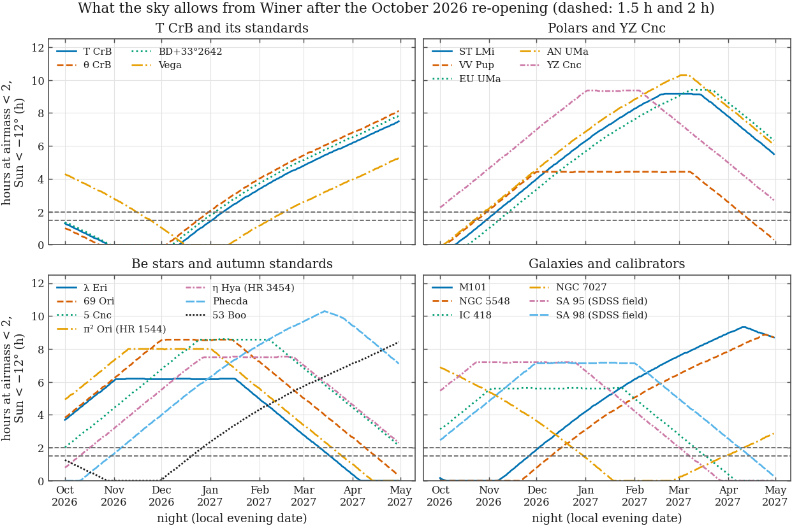
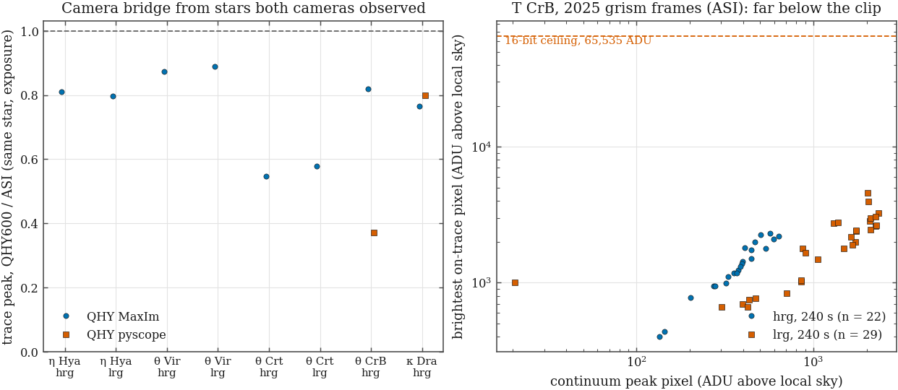

# RLMT observing and calibration request — revision 3 (October 2026 re-opening)

**From:** James Wetzel (Coe College), for the MACRO archival-analysis programme
**To:** Winer Observatory staff / RLMT operations / MACRO observing committee
**Date:** 2026-10-03 · **Status: DRAFT — not yet sent** · **Supersedes:** `ops/2026-08_observatory_request.md` (rev. 2), which should be disregarded

Revision 2 was written for cameras that are no longer on the telescope and for a sky that
is not available. A seven-seat review of the whole programme on 2026-10-03
(`committee/reviews/2026-10-03/`) said so in as many words, and this revision replaces it
entirely. Every table marked *Generated* below is written into this file by a script from
the frame manifest or from pixels in the archive; none of those numbers was typed.

## 0. What we are asking for, in one page

1. **Before anything on the telescope is touched:** an *as-found* calibration set with the
   camera exactly as the monsoon left it (§3 step a, §4).
2. **Then, in this order:** a through-focus run, a focus-versus-temperature run with filter
   offsets, bright-star grism frames, a filter-wheel repeatability test — and only then
   science (§3).
3. **Five header fixes in pyscope** so that October's frames describe the camera that took
   them (§5).
4. **A short T CrB block every clear evening until the star is lost (late October), then
   again from mid-December in the morning sky.** No two-hour runs are requested before
   January: the sky does not allow them (§2, §6.A).
5. **Standards every grism night**, including a flux standard at T CrB's own brightness
   and a compact planetary nebula through both grisms (§6.B).
6. **Answers to eight questions** (§8) — the most valuable being whether the ASI and
   AC4040 cameras still exist, and a copy of the calibration directories on the control
   computers.
7. **A T CrB eruption block loaded and dry-run** (§7; draft in `ops/eruption_block/`).

What we have **stopped** asking for is in §9.

## 1. The instrument as the archive shows it — please correct anything that is wrong

The request is written for this configuration. Each line is read from frame headers in the
archive (the last night synced is 2026-07-02); the frame named is one example.

| Item | As found | Evidence |
|---|---|---|
| Camera | QHY600M (`INSTRUME = 'QHY600Pro'`, `CAMNAME = 'QHY600MPCIE-…'`), on the telescope since 2026-03-21 | `rawimage/2026-07-01/mjc_tet_CrB_hrg_60s_2026-07-01T04-28-57.fts.fz` |
| Control software | MaxIm DL 6.40 until 2026-06-28; pyscope 0.3.1 (`SWCREATE = 'pyscope'`) from 2026-06-28 | same; `…/2026-06-12/jos_Alpha_Lyr_hrg_4s_…` |
| Gain / offset setting | `GAIN = 56`, `OFFSET = 10` (offset was 76 on 2026-03-21 only) | same |
| Set-point | −20 °C (see the CCD-TEMP census in §4; 71 frames of 2026-06-28 read 0 °C) | manifest |
| Binning | 2×2, 4800 × 3211, **averaged** (`BINCOMB = 'AVG'` in the reduced headers; overscan 172 ADU) | `reduced/2026-07-01/mjc_Alpha_Lyr_hrg_4s_…_calibrated.fts.fz` |
| Digitisation | clips at 65,535 ADU; 16-bit | `detector_params`, era group "(blank 2026)" |
| Gain in e⁻/ADU, read noise | **not measured** — `E-ADU = 1.0` and `FULLWELL = 65535` are placeholders, `EGAIN = 56` is the gain *setting* | this is what §4 item 3 is for |
| Filter wheel (`FWPOS`) | 0 g · 1 lrg · 2 r · 3 i · 4 ha · 5 hrg · 6 lum · 7 sii · 8 oiii. **No B filter.** | one frame per filter, 2026-06-28 → 07-02 |
| Filter focus offsets | `FOCOFFCG = 0` and `FWALLOFF` all zero for every filter under pyscope. In 2025 the hrg ran +650 focuser counts from g | same; TE.F4 |
| Orientation | image rotation 179.74° since 2026-03-22 (3.3° on 2026-03-21) | astrometric solutions, TE.F1 |
| Readout-mode card | `READOUTM = ''`, `READOUT = ''`; no `IMAGETYP` card | same |
| Time stamp | `DATE-OBS` to whole seconds; file names carry the *scheduled* start, which precedes `DATE-OBS` by a median of about 15 minutes | 111 frames sampled, 2026-06-28 → 07-02 |

Two consequences we want the site to know we understand:

- **October's frames are a new instrument, not a continuation of 2025.** The 2025 T CrB
  spectra were taken with the ZWO ASI camera, the wheel has since been reloaded and the
  low-resolution grism re-seated (trace angle −2° then, +7° now). We will not splice 2026
  equivalent widths onto 2025 until standards observed on the same nights say what the
  offset is. That is why §6 asks for standards on every grism night.
- **Anything that changes the optical train starts a new calibration epoch.** If the
  camera, wheel or focuser is removed, or the telescope is re-collimated, please tell us
  the date and repeat step (a) of §3 first.

## 2. What the sky allows

Hours per night above airmass 2 (altitude > 30°) with the Sun below −12° / below −18°.

<!-- BEGIN GENERATED: visibility_table -->
| Target | Programme | Oct 5 | Oct 15 | Oct 25 | Nov 1 | Nov 15 | Dec 1 | Dec 15 | Jan 1 | Jan 15 | Feb 1 | Mar 1 | Apr 1 |
|---|---|---:|---:|---:|---:|---:|---:|---:|---:|---:|---:|---:|---:|
| T CrB | T CrB | 1.1 / 0.6 | 0.6 / 0.2 | 0.2 / 0.0 | 0 | 0 | 0 | 0.2 / 0.0 | 1.4 / 0.9 | 2.4 / 1.9 | 3.4 / 2.9 | 4.8 / 4.3 | 6.2 / 5.7 |
| θ CrB | T CrB | 0.8 / 0.4 | 0.4 / 0.0 | 0 | 0 | 0 | 0 | 0.8 / 0.3 | 2.1 / 1.6 | 3.0 / 2.5 | 4.0 / 3.5 | 5.4 / 5.0 | 6.8 / 6.3 |
| Vega | T CrB / Be | 4.1 / 3.6 | 3.6 / 3.2 | 3.2 / 2.7 | 2.8 / 2.3 | 2.0 / 1.5 | 1.0 / 0.5 | 0.1 / 0.0 | 0 | 0.2 / 0.0 | 1.2 / 0.7 | 2.6 / 2.1 | 4.0 / 3.5 |
| ST LMi | CV | 0 | 0.3 / 0.0 | 1.1 / 0.6 | 1.6 / 1.2 | 2.7 / 2.2 | 4.0 / 3.5 | 5.1 / 4.6 | 6.3 / 5.8 | 7.2 / 6.7 | 8.3 / 7.8 | 9.2 / 9.2 | 7.8 / 7.3 |
| VV Pup | CV | 0 | 0.8 / 0.3 | 1.6 / 1.1 | 2.1 / 1.6 | 3.2 / 2.7 | 4.4 / 4.0 | 4.4 / 4.4 | 4.4 / 4.4 | 4.4 / 4.4 | 4.4 / 4.4 | 4.4 / 4.4 | 2.6 / 2.1 |
| EU UMa | CV | 0 | 0 | 0.5 / 0.0 | 1.0 / 0.5 | 2.1 / 1.6 | 3.4 / 2.9 | 4.5 / 4.0 | 5.7 / 5.2 | 6.6 / 6.1 | 7.6 / 7.1 | 9.0 / 8.6 | 8.6 / 8.1 |
| AN UMa | CV | 0.1 / 0.0 | 0.9 / 0.4 | 1.7 / 1.2 | 2.2 / 1.7 | 3.3 / 2.8 | 4.6 / 4.1 | 5.7 / 5.2 | 6.9 / 6.4 | 7.8 / 7.3 | 8.8 / 8.3 | 10.2 / 9.8 | 8.4 / 7.9 |
| YZ Cnc | CV | 2.6 / 2.1 | 3.3 / 2.8 | 4.1 / 3.6 | 4.6 / 4.2 | 5.7 / 5.2 | 7.0 / 6.5 | 8.1 / 7.6 | 9.3 / 8.8 | 9.3 / 9.3 | 9.4 / 9.1 | 7.4 / 6.9 | 5.0 / 4.5 |
| λ Eri | Be | 4.0 / 3.5 | 4.8 / 4.3 | 5.5 / 5.1 | 6.1 / 5.6 | 6.2 / 6.2 | 6.2 / 6.2 | 6.2 / 6.2 | 6.2 / 6.2 | 6.2 / 5.8 | 5.0 / 4.5 | 2.8 / 2.3 | 0.4 / 0.0 |
| 69 Ori | Be | 4.1 / 3.7 | 4.9 / 4.4 | 5.7 / 5.2 | 6.2 / 5.7 | 7.3 / 6.8 | 8.5 / 8.1 | 8.6 / 8.6 | 8.5 / 8.5 | 8.6 / 8.1 | 7.2 / 6.7 | 5.0 / 4.5 | 2.6 / 2.1 |
| 5 Cnc | Be | 2.3 / 1.9 | 3.1 / 2.6 | 3.9 / 3.4 | 4.4 / 3.9 | 5.5 / 5.0 | 6.8 / 6.3 | 7.8 / 7.3 | 8.6 / 8.6 | 8.6 / 8.6 | 8.6 / 8.5 | 6.8 / 6.4 | 4.4 / 3.9 |
| HD 70340 | Be | 1.2 / 0.8 | 2.0 / 1.5 | 2.8 / 2.3 | 3.3 / 2.8 | 4.4 / 3.9 | 5.7 / 5.2 | 6.7 / 6.2 | 7.0 / 7.0 | 7.0 / 7.0 | 7.0 / 7.0 | 6.4 / 5.9 | 4.0 / 3.5 |
| 53 Boo | Be | 1.1 / 0.6 | 0.6 / 0.1 | 0.1 / 0.0 | 0 | 0 | 0.1 / 0.0 | 1.1 / 0.6 | 2.4 / 1.9 | 3.3 / 2.8 | 4.3 / 3.8 | 5.7 / 5.3 | 7.1 / 6.6 |
| Phecda | Be | 0 | 0.3 / 0.0 | 1.1 / 0.7 | 1.6 / 1.2 | 2.8 / 2.3 | 4.0 / 3.5 | 5.1 / 4.6 | 6.3 / 5.8 | 7.3 / 6.8 | 8.3 / 7.8 | 9.7 / 9.2 | 9.4 / 8.7 |
| φ Leo | Be | 0 | 0 | 0 | 0.3 / 0.0 | 1.4 / 0.9 | 2.6 / 2.1 | 3.7 / 3.2 | 4.9 / 4.4 | 5.9 / 5.4 | 6.8 / 6.4 | 6.8 / 6.8 | 6.8 / 6.3 |
| Spica | Be | 0 | 0 | 0 | 0 | 0 | 0 | 1.1 / 0.6 | 2.3 / 1.8 | 3.3 / 2.8 | 4.3 / 3.8 | 5.7 / 5.2 | 5.8 / 5.8 |
| η Hya (HR 3454) | Be | 1.1 / 0.6 | 1.9 / 1.4 | 2.7 / 2.2 | 3.2 / 2.7 | 4.3 / 3.8 | 5.5 / 5.0 | 6.6 / 6.1 | 7.5 / 7.3 | 7.5 / 7.5 | 7.5 / 7.5 | 7.0 / 6.5 | 4.6 / 4.1 |
| θ Vir (HR 4963) | Be | 0 | 0 | 0 | 0 | 0 | 0.6 / 0.1 | 1.7 / 1.2 | 2.9 / 2.4 | 3.9 / 3.4 | 4.9 / 4.4 | 6.3 / 5.8 | 6.6 / 6.6 |
| θ Crt (HR 4468) | Be | 0 | 0 | 0 | 0 | 0.7 / 0.2 | 1.9 / 1.4 | 3.0 / 2.5 | 4.2 / 3.7 | 5.2 / 4.7 | 6.0 / 5.7 | 6.0 / 6.0 | 6.0 / 6.0 |
| M101 | SN 2023ixf | 0 | 0 | 0 | 0 | 0.6 / 0.1 | 1.9 / 1.4 | 3.0 / 2.5 | 4.2 / 3.7 | 5.1 / 4.6 | 6.2 / 5.7 | 7.6 / 7.1 | 9.0 / 8.5 |
| NGC 5548 | Dwarf / AGN | 0 | 0 | 0 | 0 | 0 | 0.8 / 0.3 | 1.9 / 1.4 | 3.1 / 2.6 | 4.1 / 3.6 | 5.1 / 4.6 | 6.5 / 6.0 | 7.9 / 7.4 |
| NGC 7027 | grism calibration | 6.7 / 6.2 | 6.2 / 5.8 | 5.7 / 5.3 | 5.4 / 4.9 | 4.6 / 4.1 | 3.6 / 3.1 | 2.7 / 2.2 | 1.4 / 0.9 | 0.3 / 0.0 | 0 | 0.2 / 0.0 | 1.6 / 1.1 |
| BD+33°2642 | T CrB | 1.2 / 0.7 | 0.7 / 0.3 | 0.2 / 0.0 | 0 | 0 | 0 | 0.6 / 0.1 | 1.8 / 1.3 | 2.7 / 2.2 | 3.7 / 3.2 | 5.1 / 4.7 | 6.5 / 6.0 |
| π² Ori (HR 1544) | Be | 5.2 / 4.8 | 6.0 / 5.5 | 6.8 / 6.3 | 7.3 / 6.8 | 8.0 / 7.9 | 8.0 / 8.0 | 8.0 / 8.0 | 8.0 / 7.5 | 6.9 / 6.4 | 5.6 / 5.1 | 3.4 / 2.9 | 1.0 / 0.5 |
| IC 418 | grism calibration | 3.4 / 2.9 | 4.2 / 3.7 | 5.0 / 4.5 | 5.5 / 5.0 | 5.6 / 5.6 | 5.6 / 5.6 | 5.6 / 5.6 | 5.6 / 5.6 | 5.6 / 5.6 | 5.0 / 4.5 | 2.8 / 2.3 | 0.4 / 0.0 |
| SA 95 (SDSS field) | photometric calibration | 5.8 / 5.3 | 6.5 / 6.0 | 7.2 / 6.8 | 7.2 / 7.2 | 7.2 / 7.2 | 7.2 / 7.2 | 7.2 / 7.2 | 6.7 / 6.2 | 5.6 / 5.1 | 4.2 / 3.7 | 2.0 / 1.6 | 0 |
| SA 98 (SDSS field) | photometric calibration | 2.8 / 2.3 | 3.5 / 3.1 | 4.3 / 3.9 | 4.8 / 4.4 | 6.0 / 5.5 | 7.1 / 6.7 | 7.2 / 7.2 | 7.1 / 7.1 | 7.2 / 7.2 | 7.1 / 6.7 | 5.0 / 4.5 | 2.6 / 2.1 |

Hours above airmass 2 with the Sun below −12° / below −18°, nights of 2026–2027 (columns from Jan 1 onward are 2027). `0` = never above airmass 2 in nautical darkness.

*Generated by `pipeline/scripts/ops_visibility.py` v1.0 (2026-10-03); Winer +31.6656°, -110.6018°; airmass < 2; 2-min sampling; night = local noon to noon (MST), labelled by its evening date. Do not edit by hand.*
<!-- END GENERATED: visibility_table -->

When, in the night, the targets that drive the schedule are up:

<!-- BEGIN GENERATED: visibility_windows -->
| Target | Night | Window (UT) | Length (h) | Half | Airmass in window | Sun < −15° (h) |
|---|---|---|---:|---|---|---:|
| T CrB | Oct 5 | 01:56–03:00 | 1.1 | evening | 1.45–1.99 | 0.9 |
| T CrB | Oct 15 | 01:44–02:20 | 0.6 | evening | 1.63–1.98 | 0.4 |
| T CrB | Oct 25 | 01:34–01:42 | 0.2 | evening | 1.90–2.00 | 0.0 |
| T CrB | Nov 1 | — | 0 | — | — | 0 |
| T CrB | Nov 15 | — | 0 | — | — | 0 |
| T CrB | Dec 1 | — | 0 | — | — | 0 |
| T CrB | Dec 15 | 13:06–13:18 | 0.2 | morning | 1.85–1.99 | 0.0 |
| T CrB | Jan 1 | 12:00–13:24 | 1.4 | morning | 1.35–1.98 | 1.2 |
| T CrB | Jan 15 | 11:04–13:26 | 2.4 | morning | 1.15–1.99 | 2.1 |
| T CrB | Feb 1 | 09:58–13:20 | 3.4 | morning | 1.05–1.98 | 3.1 |
| T CrB | Mar 1 | 08:08–12:54 | 4.8 | morning | 1.01–1.98 | 4.6 |
| T CrB | Apr 1 | 06:06–12:16 | 6.2 | spans midnight | 1.01–1.98 | 5.9 |
| ST LMi | Oct 5 | — | 0 | — | — | 0 |
| ST LMi | Oct 15 | 12:14–12:32 | 0.3 | morning | 1.80–2.00 | 0.1 |
| ST LMi | Oct 25 | 11:36–12:40 | 1.1 | morning | 1.45–1.98 | 0.9 |
| ST LMi | Nov 1 | 11:08–12:44 | 1.6 | morning | 1.30–1.99 | 1.4 |
| ST LMi | Nov 15 | 10:14–12:56 | 2.7 | morning | 1.11–1.98 | 2.5 |
| ST LMi | Dec 1 | 09:10–13:08 | 4.0 | morning | 1.02–1.99 | 3.7 |
| ST LMi | Dec 15 | 08:16–13:18 | 5.1 | morning | 1.01–1.98 | 4.8 |
| ST LMi | Jan 1 | 07:08–13:24 | 6.3 | morning | 1.01–1.99 | 6.1 |
| ST LMi | Jan 15 | 06:14–13:26 | 7.2 | spans midnight | 1.01–1.98 | 7.0 |
| ST LMi | Feb 1 | 05:06–13:20 | 8.3 | spans midnight | 1.01–1.99 | 8.0 |
| ST LMi | Mar 1 | 03:16–12:24 | 9.2 | spans midnight | 1.01–1.99 | 9.2 |
| ST LMi | Apr 1 | 02:36–10:22 | 7.8 | spans midnight | 1.01–1.99 | 7.6 |
| λ Eri | Oct 5 | 08:28–12:26 | 4.0 | morning | 1.31–1.99 | 3.8 |
| λ Eri | Oct 15 | 07:48–12:32 | 4.8 | morning | 1.31–1.99 | 4.5 |
| λ Eri | Oct 25 | 07:10–12:40 | 5.5 | morning | 1.31–1.98 | 5.3 |
| λ Eri | Nov 1 | 06:42–12:44 | 6.1 | spans midnight | 1.31–1.99 | 5.8 |
| λ Eri | Nov 15 | 05:46–11:56 | 6.2 | spans midnight | 1.31–2.00 | 6.2 |
| λ Eri | Dec 1 | 04:44–10:52 | 6.2 | spans midnight | 1.31–1.99 | 6.2 |
| λ Eri | Dec 15 | 03:48–09:58 | 6.2 | spans midnight | 1.31–2.00 | 6.2 |
| λ Eri | Jan 1 | 02:42–08:50 | 6.2 | spans midnight | 1.31–1.99 | 6.2 |
| λ Eri | Jan 15 | 01:46–07:56 | 6.2 | spans midnight | 1.31–2.00 | 6.1 |
| λ Eri | Feb 1 | 01:52–06:48 | 5.0 | evening | 1.31–1.98 | 4.7 |
| λ Eri | Mar 1 | 02:14–04:58 | 2.8 | evening | 1.32–1.98 | 2.5 |
| λ Eri | Apr 1 | 02:36–02:56 | 0.4 | evening | 1.80–1.98 | 0.1 |
| M101 | Oct 5 | — | 0 | — | — | 0 |
| M101 | Oct 15 | — | 0 | — | — | 0 |
| M101 | Oct 25 | — | 0 | — | — | 0 |
| M101 | Nov 1 | — | 0 | — | — | 0 |
| M101 | Nov 15 | 12:20–12:56 | 0.6 | morning | 1.73–1.99 | 0.4 |
| M101 | Dec 1 | 11:16–13:08 | 1.9 | morning | 1.38–2.00 | 1.6 |
| M101 | Dec 15 | 10:22–13:18 | 3.0 | morning | 1.21–1.99 | 2.7 |
| M101 | Jan 1 | 09:14–13:24 | 4.2 | morning | 1.11–2.00 | 4.0 |
| M101 | Jan 15 | 08:20–13:26 | 5.1 | morning | 1.08–1.99 | 4.9 |
| M101 | Feb 1 | 07:12–13:20 | 6.2 | morning | 1.08–2.00 | 5.9 |
| M101 | Mar 1 | 05:22–12:54 | 7.6 | spans midnight | 1.08–2.00 | 7.3 |
| M101 | Apr 1 | 03:20–12:16 | 9.0 | spans midnight | 1.08–2.00 | 8.7 |

Longest continuous interval above airmass 2 with the Sun below −12°; the last column is the total with the Sun below −15°, the limit adopted for grism exposures.

*Generated by `pipeline/scripts/ops_visibility.py` v1.0 (2026-10-03); Winer +31.6656°, -110.6018°; airmass < 2; 2-min sampling; night = local noon to noon (MST), labelled by its evening date. Do not edit by hand.*
<!-- END GENERATED: visibility_windows -->

First and last useful night for each kind of observation:

<!-- BEGIN GENERATED: visibility_dates -->
| Target | ≥ 0.25 h (snapshot block) | ≥ 1.5 h (one polar orbit) | ≥ 2 h (flickering / whole-orbit run) | Grism: ≥ 0.25 h, Sun < −15° |
|---|---|---|---|---|
| T CrB | (open) 2026-10-01 → 2026-10-23; 2026-12-16 → 2027-04-30 (open) | 2027-01-02 → 2027-04-30 (open) | 2027-01-09 → 2027-04-30 (open) | (open) 2026-10-01 → 2026-10-18; 2026-12-19 → 2027-04-30 (open) |
| θ CrB | (open) 2026-10-01 → 2026-10-17; 2026-12-08 → 2027-04-30 (open) | 2026-12-24 → 2027-04-30 (open) | 2026-12-31 → 2027-04-30 (open) | (open) 2026-10-01 → 2026-10-12; 2026-12-11 → 2027-04-30 (open) |
| Vega | (open) 2026-10-01 → 2026-12-12; 2027-01-17 → 2027-04-30 (open) | (open) 2026-10-01 → 2026-11-24; 2027-02-07 → 2027-04-30 (open) | (open) 2026-10-01 → 2026-11-15; 2027-02-17 → 2027-04-30 (open) | (open) 2026-10-01 → 2026-12-08; 2027-01-21 → 2027-04-30 (open) |
| ST LMi | 2026-10-14 → 2027-04-30 (open) | 2026-10-30 → 2027-04-30 (open) | 2026-11-06 → 2027-04-30 (open) | 2026-10-18 → 2027-04-30 (open) |
| VV Pup | 2026-10-08 → 2027-04-30 (open) | 2026-10-24 → 2027-04-15 | 2026-10-31 → 2027-04-08 | 2026-10-11 → 2027-04-27 |
| EU UMa | 2026-10-22 → 2027-04-30 (open) | 2026-11-07 → 2027-04-30 (open) | 2026-11-14 → 2027-04-30 (open) | 2026-10-25 → 2027-04-30 (open) |
| AN UMa | 2026-10-07 → 2027-04-30 (open) | 2026-10-23 → 2027-04-30 (open) | 2026-10-29 → 2027-04-30 (open) | 2026-10-10 → 2027-04-30 (open) |
| YZ Cnc | (open) 2026-10-01 → 2027-04-30 (open) | (open) 2026-10-01 → 2027-04-30 (open) | (open) 2026-10-01 → 2027-04-30 (open) | (open) 2026-10-01 → 2027-04-30 (open) |
| λ Eri | (open) 2026-10-01 → 2027-04-02 | (open) 2026-10-01 → 2027-03-17 | (open) 2026-10-01 → 2027-03-11 | (open) 2026-10-01 → 2027-03-30 |
| 69 Ori | (open) 2026-10-01 → 2027-04-30 (open) | (open) 2026-10-01 → 2027-04-15 | (open) 2026-10-01 → 2027-04-09 | (open) 2026-10-01 → 2027-04-27 |
| 5 Cnc | (open) 2026-10-01 → 2027-04-30 (open) | (open) 2026-10-01 → 2027-04-30 (open) | (open) 2026-10-01 → 2027-04-30 (open) | (open) 2026-10-01 → 2027-04-30 (open) |
| HD 70340 | (open) 2026-10-01 → 2027-04-30 (open) | 2026-10-09 → 2027-04-30 (open) | 2026-10-16 → 2027-04-26 | (open) 2026-10-01 → 2027-04-30 (open) |
| 53 Boo | (open) 2026-10-01 → 2026-10-22; 2026-12-04 → 2027-04-30 (open) | 2026-12-20 → 2027-04-30 (open) | 2026-12-27 → 2027-04-30 (open) | (open) 2026-10-01 → 2026-10-18; 2026-12-07 → 2027-04-30 (open) |
| Phecda | 2026-10-14 → 2027-04-30 (open) | 2026-10-30 → 2027-04-30 (open) | 2026-11-06 → 2027-04-30 (open) | 2026-10-17 → 2027-04-30 (open) |
| φ Leo | 2026-11-01 → 2027-04-30 (open) | 2026-11-17 → 2027-04-30 (open) | 2026-11-23 → 2027-04-30 (open) | 2026-11-04 → 2027-04-30 (open) |
| Spica | 2026-12-05 → 2027-04-30 (open) | 2026-12-21 → 2027-04-30 (open) | 2026-12-28 → 2027-04-30 (open) | 2026-12-08 → 2027-04-30 (open) |
| η Hya (HR 3454) | (open) 2026-10-01 → 2027-04-30 (open) | 2026-10-10 → 2027-04-30 (open) | 2026-10-17 → 2027-04-30 (open) | (open) 2026-10-01 → 2027-04-30 (open) |
| θ Vir (HR 4963) | 2026-11-27 → 2027-04-30 (open) | 2026-12-12 → 2027-04-30 (open) | 2026-12-19 → 2027-04-30 (open) | 2026-11-30 → 2027-04-30 (open) |
| θ Crt (HR 4468) | 2026-11-10 → 2027-04-30 (open) | 2026-11-26 → 2027-04-30 (open) | 2026-12-03 → 2027-04-30 (open) | 2026-11-13 → 2027-04-30 (open) |
| M101 | 2026-11-11 → 2027-04-30 (open) | 2026-11-26 → 2027-04-30 (open) | 2026-12-03 → 2027-04-30 (open) | 2026-11-14 → 2027-04-30 (open) |
| NGC 5548 | 2026-11-25 → 2027-04-30 (open) | 2026-12-10 → 2027-04-30 (open) | 2026-12-17 → 2027-04-30 (open) | 2026-11-28 → 2027-04-30 (open) |
| NGC 7027 | (open) 2026-10-01 → 2027-01-15; 2027-03-02 → 2027-04-30 (open) | (open) 2026-10-01 → 2026-12-30; 2027-03-30 → 2027-04-30 (open) | (open) 2026-10-01 → 2026-12-23; 2027-04-11 → 2027-04-30 (open) | (open) 2026-10-01 → 2027-01-12; 2027-03-08 → 2027-04-30 (open) |
| BD+33°2642 | (open) 2026-10-01 → 2026-10-24; 2026-12-12 → 2027-04-30 (open) | 2026-12-28 → 2027-04-30 (open) | 2027-01-05 → 2027-04-30 (open) | (open) 2026-10-01 → 2026-10-20; 2026-12-15 → 2027-04-30 (open) |
| π² Ori (HR 1544) | (open) 2026-10-01 → 2027-04-10 | (open) 2026-10-01 → 2027-03-25 | (open) 2026-10-01 → 2027-03-19 | (open) 2026-10-01 → 2027-04-07 |
| IC 418 | (open) 2026-10-01 → 2027-04-02 | (open) 2026-10-01 → 2027-03-17 | (open) 2026-10-01 → 2027-03-11 | (open) 2026-10-01 → 2027-03-30 |
| SA 95 (SDSS field) | (open) 2026-10-01 → 2027-03-24 | (open) 2026-10-01 → 2027-03-07 | (open) 2026-10-01 → 2027-03-01 | (open) 2026-10-01 → 2027-03-21 |
| SA 98 (SDSS field) | (open) 2026-10-01 → 2027-04-30 (open) | (open) 2026-10-01 → 2027-04-15 | (open) 2026-10-01 → 2027-04-08 | (open) 2026-10-01 → 2027-04-27 |

First → last night, within the scan 2026-10-01 → 2027-04-30, offering at least the stated hours above airmass 2 with the Sun below −12° (last column: below −15°). Two intervals = an evening and a morning apparition separated by solar conjunction. `(open)` = the interval runs past that end of the scan.

*Generated by `pipeline/scripts/ops_visibility.py` v1.0 (2026-10-03); Winer +31.6656°, -110.6018°; airmass < 2; 2-min sampling; night = local noon to noon (MST), labelled by its evening date. Do not edit by hand.*
<!-- END GENERATED: visibility_dates -->

Read plainly:

- **T CrB** is an evening-twilight object for about three weeks after re-opening, always
  at airmass 1.5–2, and is then lost until mid-December, when it returns in the morning.
  A run of one and a half hours first fits in the first days of January and a two-hour run
  about a week later (table above). Revision 2's "weekly ≥ 2 h run resuming at
  re-opening" could not have been carried out and is withdrawn.
- **ST LMi** does not rise far enough before dawn for a whole orbit until the end of
  October. Revision 2's "starts at re-opening" is withdrawn.
- **The Be-star targets and their autumn standard are well placed from the first night**
  and are the natural use of the dark hours in October and November.
- **M101 and NGC 5548** are not observable before mid-November and late November.

## 3. Re-opening protocol — in this order

The order matters more than any single item: step (a) records the instrument exactly as
it sat through the summer, and every later step may change it.

| Step | What | Why this, why now |
|---|---|---|
| **a** | **As-found calibration, before anyone adjusts anything:** flats in *every* filter including hrg and lrg, biases, darks (§4). | No flat exists in the archive for any QHY frame, in any filter (§4, generated). The flat is specific to this camera orientation and this dust; once the train is disturbed it can never be taken. |
| **b** | **Through-focus sequence** on a bright, moderately crowded field in g: 11 positions spanning ±1,000 focuser counts about best focus, 3 × 10 s each. | 665 of 728 frames on 2026-06-25 sat about 1,000 counts from that month's focus with stars twice as long as wide (TE.F8). Elongated out-of-focus images mean astigmatism; this run measures it and tells you whether collimation is needed. |
| **c** | **Focus versus temperature** (the same short sequence at dusk, midnight and dawn on one night) **and filter focus offsets** for all nine filters, loaded into pyscope. | `FOCOFFCG` is 0 for every filter; `FOCTEMP` is blank. The grism line width depends on focus (TE.F4). |
| **d** | **Vega and θ CrB through hrg and lrg** (Vega 4 s hrg, 0.25 s lrg; θ CrB 60 s hrg, as in June), placed at the usual reposition pixel, ×5 each. | Fixes the trace angle, the zero-order position and the dispersion for this mechanical state from hot stars with known lines. Vega is an evening object only until early December (§2). |
| **e** | **Filter-wheel repeatability:** ten cycles g → hrg → lrg → g on a bright star, one short exposure at each stop. | Slitless wavelength zero points move with the grism's seating; this measures by how much. |
| **f** | **Science** (§6). | |

**If (b) leads to re-collimation, or the camera is removed for any reason, that is a new
mechanical epoch: please log the date (§8, question 4) and repeat (a) before science.**

## 4. Calibration set — for the camera that is mounted

What the archive holds, and therefore what is missing:

<!-- BEGIN GENERATED: calibration_census -->
| Exposure (s) | Light frames | Cumulative | Dark requested |
|---:|---:|---:|---|
| 10 | 6,062 | 20.8% | yes |
| 5 | 5,350 | 39.2% | yes |
| 15 | 3,578 | 51.4% | yes |
| 60 | 2,911 | 61.4% | yes |
| 30 | 2,592 | 70.3% | yes |
| 120 | 1,774 | 76.4% | yes |
| 300 | 1,500 | 81.6% | yes |
| 180 | 1,094 | 85.3% | yes |
| 90 | 913 | 88.5% | yes |
| 20 | 879 | 91.5% | yes |
| 45 | 855 | 94.4% | yes |
| 240 | 586 | 96.4% | yes |
| 0.25 | 197 | 97.1% | no (scaled) |
| 3 | 131 | 97.5% | no (scaled) |
| 200 | 130 | 98.0% | no (scaled) |
| 0.125 | 128 | 98.4% | no (scaled) |
| 4 | 123 | 98.9% | no (scaled) |

Dark set requested (12 exposures): 5, 10, 15, 20, 30, 45, 60, 90, 120, 180, 240, 300 s.

| Filter | Light frames | Raw flats in archive |
|---|---:|---:|
| g | 20,208 | 0 |
| r | 3,039 | 0 |
| i | 1,488 | 0 |
| hrg | 1,322 | 0 |
| ha | 1,200 | 0 |
| lrg | 1,039 | 0 |
| lum | 371 | 0 |
| oiii | 236 | 0 |
| sii | 235 | 0 |

QHY600 raw frames in the archive: 29,148 (2026-03-21 → 2026-07-02, manifest eras 78, 81). Raw bias, dark or flat frames among them: 0. CCD-TEMP census — -20 °C: 29,076; +0 °C: 71; no card: 1. Darks are requested at every exposure needed to cover 95% of the light frames plus the exposures this request itself asks for; rarer exposures are scaled from the nearest longer dark.

*Generated by `pipeline/scripts/ops_exposure.py` v1.0 (2026-10-03) from `ops/generated/exposure_measurements.csv` and the manifest. Do not edit by hand.*
<!-- END GENERATED: calibration_census -->

The reduced headers show that master frames *do* exist on the control computer (`CALHOST =
'TCC21'`: `master_bias.fts` from 40 frames, `master_dark_4s.fts` from 40 frames,
`master_flat_g.fts`). They were never synced. §8 question 2 asks for them; the list below
is what we need whether or not they arrive.

1. **Bias × 50** at the −20 °C set-point, in the as-found mode, gain and offset.
2. **Darks × 20 at each exposure in the generated list above**, at the set-point. If time
   is short, the order is 240, 60, 10, 5, 15, 120 s (the exposures §6 uses), then the rest.
3. **Flat *pairs* at six signal levels per filter — all nine filters, hrg and lrg
   included** — two consecutive frames at each of roughly 2, 5, 10, 20, 40 and 60 kADU
   (twilight, or a dome lamp with the exposure time stepped). The same frames give the
   flat field, the photon-transfer gain (e⁻/ADU) and read noise, and the linearity curve
   up to the clip. This single item replaces three separate requests of revision 2.
4. **A dome-lamp linearity ladder** in one filter: a fixed lamp, exposures stepped ×2 from
   the shortest practical to saturation, with the first exposure repeated at the end to
   measure lamp drift.
5. **Per-temperature hot-pixel record:** if the camera is ever run at a set-point other
   than −20 °C, 10 darks at 60 s at that temperature. (Averaged binning hides a saturated
   native pixel as a ≈ 16.5 kADU binned pixel; we mask those from darks.)
6. **Please keep one set-point all season**, and say in advance if it must change.
7. **Raw calibration frames into the archive bucket**, not only the masters, with
   `IMAGETYP` set (§5).

*Acceptance (ours, so you can see what "enough" means):* gain to ±3 % and read noise per
filter-independent fit; linearity residual below 1 % up to the cap we adopt; a flat for
every filter taken within 7 days of any science night that uses it.

## 5. Header fixes for pyscope

Each of these has cost real analysis time; four of them create a spurious "new instrument"
in our bookkeeping every time the string changes.

| Card | As found (pyscope 0.3.1) | Wanted | Why |
|---|---|---|---|
| `READOUTM` / `READOUT` | empty strings | the QHY readout mode by name or number, every frame | Our configuration registry keys on it. A blank is indistinguishable from "unknown". |
| `IMAGETYP` | card absent | `Light`, `Bias`, `Dark`, `Flat` | Calibration frames cannot otherwise be found (`BLKTYPE` is not carried by every tool). |
| `EGAIN`, `E-ADU`, `FULLWELL`, `MAXADU` | `EGAIN = 56` (the gain *setting*), `E-ADU = 1.0`, `FULLWELL = 65535`, `MAXADU = 255` | `GAIN` = setting (as now); `EGAIN` = e⁻/ADU once measured (§4.3), or omit; `MAXADU = 65535` | A gain setting in the e⁻/ADU card silently corrupts every noise model that trusts the header. |
| `OFFSET` | present (10); blank on some frames of 2026-06-28 | always written | Part of the detector configuration. |
| `DATE-OBS` | whole seconds | start of exposure to ≥ 0.01 s, plus `DATE-END` or a mid-exposure card | Polar timing work quotes tens of seconds; the truncation is an avoidable half-second. |
| File-name time | scheduled start (`BLKSTRT`), a median of ~15 min before `DATE-OBS` | no change needed, but please confirm that `DATE-OBS` is the shutter-open time read from the PC clock, and tell us how that clock is disciplined (§8 q. 7) | We use `DATE-OBS`; we need to know it is the truth. |
| `CCD-TEMP`, `SET-TEMP` | real values on most frames; one frame reads −0.0 for both, 71 frames of 2026-06-28 read 0 °C | never a default value; if the read fails, omit the card | Darks are matched on temperature. |
| `FWALLNAM` | written with `CONTINUE` cards that carry no string value, which strict FITS readers reject (astropy raises `VerifyError`) | one valid long-string card, or a short comma list | The wheel map is how we know which grism is where. |
| `FOCOFFCG`, `FWALLOFF`, `FOCTEMP` | 0, all zeros, blank | the offsets actually applied; focuser temperature | §3 step c; the focus regressor in every grism analysis. |
| `RA`/`DEC`/`OBJCTRA` | in March 2025 some frames carried the previous target's coordinates | written after the slew completes | 21 good T CrB spectra were rejected by a header test before we caught this (OA.E2). |
| Binning method | `BINCOMB` appears only in reduced frames | a card in the **raw** header stating sum or average | Saturation is judged in native pixels; average binning hides it. |
| Orientation | `FLIPSTAT` absent under pyscope; `TELPIER` present | either card, consistently | Flats and traces are orientation-specific. |

## 6. Science programme, with the dates the sky allows

### 6.A T CrB — the time-critical item

**Dates.** Evening block every clear night from re-opening until the star drops below
airmass 2 in late October; nothing until mid-December; morning block every clear night
from then on (§2, generated). Grism exposures only with the Sun below −15° — twilight
fills the slitless sky background — which shortens the October window further (last
column of the windows table).

**Nightly block (about 15 minutes), in this order:**

| # | Filter | Exposure | Purpose |
|---|---|---|---|
| 1 | hrg | 1 × 240 s | Hα equivalent width, high resolution |
| 2 | lrg | 1 × 240 s | Hα equivalent width, low resolution |
| 3 | g | 5 × 10 s, **telescope defocused to ≈ 4″ FWHM** | photometric anchor and continuum for the Hα flux |
| 4 | r | 5 × 10 s, same defocus | same |
| 5 | i | 5 × 10 s, same defocus (drop first if the window is short) | same |

With the two standards of §6.B the visit takes about 25 minutes. When the window with
the Sun below −15° is shorter than that (the windows table in §2 shows it shrinking
through October), the order of priority is: T CrB hrg, T CrB lrg, θ CrB, the imaging,
BD+33°2642.

*Why these exposures.* T CrB has never been observed with the QHY, so the numbers are
derived, not copied. For the grisms we measured the trace peak of stars that both cameras
observed through the same grism at the same exposure, and scaled the 2025 T CrB frames
by that ratio:

<!-- BEGIN GENERATED: exposure_bridge -->
| Star | Grism | Exp (s) | ASI Mode0 peak (ADU), n | QHY MaxIm peak (ADU), n | QHY MaxIm / ASI | QHY pyscope peak (ADU), n | QHY pyscope / ASI |
|---|---|---:|---:|---:|---:|---:|---:|
| η Hya | hrg | 60 | 8,453 ± 925, 8 | 6,852 ± 377, 6 | 0.81 | — | — |
| η Hya | lrg | 15 | 27,909 ± 2,597, 8 | 22,264 ± 2,002, 7 | 0.80 | — | — |
| θ Vir | hrg | 60 | 7,632 ± 1,412, 8 | 6,659 ± 882, 6 | 0.87 | — | — |
| θ Vir | lrg | 15 | 25,520 ± 3,911, 8 | 22,688 ± 6,042, 6 | 0.89 | — | — |
| θ Crt | hrg | 60 | 6,154 ± 1,161, 8 | 3,366 ± 1,025, 8 | 0.55 | — | — |
| θ Crt | lrg | 15 | 21,313 ± 3,858, 8 | 12,315 ± 4,792, 7 | 0.58 | — | — |
| θ CrB | hrg | 60 | 9,528 ± 322, 8 | 7,814 ± 111, 8 | 0.82 | 3,531 ± 360, 5 | 0.37 |
| κ Dra | hrg | 60 | 12,064 ± 876, 8 | 9,222 ± 559, 8 | 0.76 | 9,628 ± 1,835, 8 | 0.80 |
| **adopted** | **hrg** | | | **QHY MaxIm: 0.81** (range 0.55–0.87, 5 stars) | | | |
| **adopted** | **hrg** | | | **QHY pyscope: 0.58** (range 0.37–0.80, 2 stars) | | | |
| **adopted** | **lrg** | | | **QHY MaxIm: 0.80** (range 0.58–0.89, 3 stars) | | | |

Peak = upper quartile over frames of the 90th-percentile per-column peak pixel along the trace, ADU above sky, 2×2 average-binned pixels; ± is 1.4826 × MAD over frames; n = frames kept (twilight, clipped and no-star frames rejected). Same star, same grism, same exposure on both cameras.

*Generated by `pipeline/scripts/ops_exposure.py` v1.0 (2026-10-03) from `ops/generated/exposure_measurements.csv` and the manifest. Do not edit by hand.*
<!-- END GENERATED: exposure_bridge -->

<!-- BEGIN GENERATED: exposure_grism -->
| Grism | T CrB on ASI, frames used | Continuum peak (ADU) | Brightest on-trace pixel, median / max (ADU) | Sky under trace (ADU) | QHY / ASI | Predicted on QHY, median / max (ADU) | Brightest raw native pixel (ADU) | Fraction of 60,200 ADU veto |
|---|---:|---:|---:|---:|---:|---:|---:|---:|
| hrg 240 s | 22 of 22 | 389 ± 106 | 1,352 / 2,315 | 46 | 0.81 | 1,096 / 1,877 | 2,453 | 4.1% |
| lrg 240 s | 29 of 32 | 1,489 ± 923 | 1,988 / 4,572 | 234 | 0.80 | 1,586 / 3,647 | 4,812 | 8.0% |

T CrB frames are the gate-accepted rows of `g_extractions` (method `flanking`) whose fitted trace stands at least 3× above the same statistic in an empty flanking band. Levels are peak pixels above the local sky (median of two bands 25–60 rows either side of the trace). The brightest on-trace pixel is the Hα line in hrg; in lrg it is the line or the zero-order image. The prediction uses the QHY/ASI ratio measured under MaxIm (the larger, hence conservative, of the two QHY ratios); the raw-pixel column adds the sky and the 174 ADU pedestal and applies the ×1.16 native-pixel factor to the brightest archival frame.

*Generated by `pipeline/scripts/ops_exposure.py` v1.0 (2026-10-03) from `ops/generated/exposure_measurements.csv` and the manifest. Do not edit by hand.*
<!-- END GENERATED: exposure_grism -->

So 240 s is retained: the brightest pixel is predicted at under a tenth of the 16-bit
range, and keeping the exposure keeps the 2026 spectra comparable in depth with 2025.
(The few frames from the pyscope-native days — θ CrB and κ Dra, last rows of the bridge
table — give a lower ratio for θ CrB than the MaxIm months do; with `FOCOFFCG = 0` that
may be a defocused hrg, or cloud. Step (d) of §3 will tell.) Revision 2's "same mode"
cannot be honoured — the mode no longer exists — and its worry about the clip belonged to
a different camera.

For the imaging, revision 2 asked for "3 × 1 s in r … to stay below the High-Gain clip".
That clip (3.5 kADU) was the SBIG AC4040's; and 1 s is scintillation-limited at about one
percent. From the zero points and image sizes the pyscope reduction wrote into the June
frames:

<!-- BEGIN GENERATED: exposure_imaging -->
| Filter | ZMAG (as found), n | Median FWHM (″) | Assumed T CrB mag | t at FWHM 2″ (s) | t at FWHM 2.5″ (s) | t at FWHM 4″ (s) | t at FWHM 6″ (s) | t at FWHM 8″ (s) |
|---|---:|---:|---:|---:|---:|---:|---:|---:|
| g | 23.01 ± 0.03, 974 | 2.2 | 10.7 ± 0.5 | 5.8 (3.6–9.2) | 9.0 (5.7–14.3) | 23.1 (14.6–36.7) | 52.0 (32.8–82.5) | 92.5 (58.4–146.6) |
| r | 22.22 ± 0.05, 105 | 2.2 | 9.5 ± 0.5 | 4.0 (2.5–6.3) | 6.2 (3.9–9.8) | 15.9 (10.0–25.1) | 35.7 (22.5–56.5) | 63.4 (40.0–100.5) |
| i | 21.13 ± 0.09, 102 | 2.1 | 8.3 ± 0.5 | 3.6 (2.3–5.7) | 5.6 (3.5–8.9) | 14.3 (9.0–22.7) | 32.2 (20.3–51.1) | 57.3 (36.2–90.8) |

Exposure that brings the brightest native pixel of T CrB to 25,000 ADU for a Gaussian image of the stated FWHM; in parentheses the range for the star 0.5 mag brighter – fainter than assumed. ZMAG and FWHM are medians over the reduced frames of era 82 (2026-06-28 → 07-02, the as-found configuration).

Scintillation (Young; D = 50.8 cm, h = 1515.7 m), mmag at airmass 1.2 / 1.8 — 1 s: 5.7 / 11.7 · 5 s: 2.6 / 5.2 · 10 s: 1.8 / 3.7 · 20 s: 1.3 / 2.6.

ZMAG is a per-second zero point: slope of ZMAG against 2.5 log₁₀ t over all QHY reduced frames — g -0.063 (n = 19,193), r +0.077 (n = 2,517), i +0.221 (n = 1,333) (0 = per second, 1 = per exposure).

*Generated by `pipeline/scripts/ops_exposure.py` v1.0 (2026-10-03) from `ops/generated/exposure_measurements.csv` and the manifest. Do not edit by hand.*
<!-- END GENERATED: exposure_imaging -->

In focus, the exposure that fills the well to mid-range is only a few seconds, where
scintillation at October's airmass is several millimagnitudes per frame; a mild defocus
to about 4″ lets 10 s exposures sit in the lower-middle of the range with room for good
seeing. **If a per-block focus offset is not practical in pyscope, the fallback is in
focus: 5 × 5 s in g and 5 × 3 s in r and in i** (the 2″–2.5″ columns of the table), and we
accept the larger scintillation. Please tell us which you can do. **Acceptance, to be
checked on the first night and the exposure adjusted if it fails: T CrB's peak pixel
between 15 and 40 kADU in every filter; check-star scatter below 5 mmag.** The magnitudes
assumed are good to a few tenths, which is why the table shows a range.

**No B filter is in the wheel.** The only clean 2023–24 photometric anchors we hold are in
B (R and I were clipped), so the new photometry cannot be tied to them band for band. See
§8 question 5.

**Standards on every T CrB grism night** (§6.B): BD+33°2642 and θ CrB, both within 8° of
the target, same grisms.

**What is not requested before January:** long runs. The flickering study needs ≥ 2 h of
continuous coverage, which the table above first allows in the second week of January;
it has been moved out of the first paper and into a 2027 list. From then, when it can be
scheduled: one ≥ 2 h run per week in g at ≤ 60 s cadence, six runs in all.

### 6.B Standards and grism calibration (every grism night, all programmes)

| Star | Role | When (§2) | Exposure |
|---|---|---|---|
| BD+33°2642 (CALSPEC, V 10.8, 7° from T CrB) | flux standard at the target's brightness; a non-Be comparison | with T CrB | 240 s hrg + 240 s lrg, once per T CrB night |
| θ CrB | T CrB's long-standing comparison (a variable Be star: a *consistency* check, not a flux standard) | with T CrB | 60 s hrg (as in June); 15 s lrg — *never yet taken through lrg with this camera: first-night check as below* |
| Vega | spectrophotometric and telluric standard; dispersion from hot-star lines | evening until early December, morning from late January | 4 s hrg, 0.25 s lrg, × 5 |
| π² Ori (HR 1544, A1 V) | the autumn nightly standard, beside λ Eri | all night from re-opening | 60 s hrg, 15 s lrg (the exposures used for θ Vir, a star of the same type and brightness) — *first-night check: trace peak 15–40 kADU, adjust* |
| η Hya (HR 3454), θ Vir (HR 4963), θ Crt (HR 4468) | the 2025–26 stability standards; they bridge this season to last | η Hya from October; θ Crt mid-November; θ Vir December | 60 s hrg, 15 s lrg (unchanged from last season — the bridge depends on it) |
| **A compact planetary nebula: IC 418** (autumn–winter) **or NGC 7027** (evenings to December) | emission lines at known wavelengths through *both* grisms: the wavelength scale and the measured line-spread function | see §2 | 30 s and 120 s, hrg and lrg, on three nights early in the season and after any change to the train |
| One SDSS standard field — SA 95 or SA 98 | colour terms for g, r, i | all season | 3 × 30 s per filter, in focus, at two airmasses on one photometric night |

*Acceptance:* a standard on at least 80 % of T CrB grism nights and on every Be-star
science night; the planetary nebula in both grisms on ≥ 3 nights.

### 6.C Be stars — second season (queue priority below T CrB; fills the dark hours)

λ Eri and 69 Ori are up for four hours or more from the first night and 5 Cnc for two
(§2), HD 70340 shortly after; Phecda and φ Leo come up in November; 53 Boo returns in late December.
Same exposures as last season (λ Eri and 69 Ori 120 s hrg; 5 Cnc 240 s hrg), one visit per
star per clear night, with π² Ori (or η Hya from December) on the same night. This item
belongs to our 2027 list, not to a paper in preparation, and yields to §6.A whenever they
conflict.

*Later in the season, when convenient:* the same bright star placed at three detector
positions through each grism (centre and ± 500 px along the dispersion) — a substitute for
grism flats, which cannot be taken conventionally.

### 6.D ST LMi (queue, from about 1 November)

Whole-orbit blocks only: ≥ 2 h continuous (the orbit is 114 min), **one filter per night**
(g one night, r the next, i the next), alternating with nights cycling g–r–i; 60 s
exposures as in 2025; flats in the filters used within 7 days. First possible date in the
generated dates table (§2). The paper in hand does not wait for these data.

### 6.E M101 (conditional, from mid-December)

Only if the answer to §8 question 1 is that the **AC4040** can be remounted: deep g, r, i
template images of M101 for subtraction against the 2023 supernova frames. With the QHY
alone we already hold March 2026 frames and need nothing further.

### 6.F NGC 5548 — nothing requested

The 2023 "photometric monitoring" frames were taken through a grism on every night and
that project has been closed. Please do not schedule it on our account.

## 7. T CrB eruption response

A draft schedule block and operating notes are in `ops/eruption_block/`. Revision 2 asked
for the block to be "verified loaded by 2026-09-01"; nothing in the archive or in our
records shows that it was. The request now is concrete: **load the draft, run it once as a
dry run on any bright star, and send us the log.** The exposure ladder in it is derived
from the same measurements as §6.A:

<!-- BEGIN GENERATED: exposure_eruption -->
| V | Brightening (×) | hrg exposure (s) | lrg exposure (s) |
|---:|---:|---:|---:|
| 2 | 1,585 | 1.7 | 0.89 |
| 3 | 631 | 4.4 | 2.2 |
| 4 | 251 | 11 | 5.6 |
| 5 | 100 | 28 | 14 |
| 6 | 40 | 69 | 36 |
| 7 | 16 | 170 | 89 |
| 8 | 6 | 440 | 220 |
| 9 | 3 | 1,100 | 560 |
| 10 | 1 | 2,800 | 1,400 |

Exposure that brings the brightest native trace pixel to 25,000 ADU (ceiling 65,534), scaling the measured quiescent rate (hrg 9.1, lrg 17.6 ADU s⁻¹ at V = 10, assumed) by the V-band brightening. Order of magnitude only: the eruption spectrum is hotter than the quiescent one and Hα will not scale with V. The schedule block therefore brackets each value by ×4 either side.

*Generated by `pipeline/scripts/ops_exposure.py` v1.0 (2026-10-03) from `ops/generated/exposure_measurements.csv` and the manifest. Do not edit by hand.*
<!-- END GENERATED: exposure_eruption -->

If the eruption comes during the conjunction gap (§2), the telescope cannot reach the star
above airmass 2 at all; the block's README gives the relaxed limits and what is and is not
worth attempting.

## 8. Questions for the site

1. **Do the ZWO ASI camera (on the telescope 2024-12 → 2026-03) and the SBIG AC4040
   (2023-02 → 2024-03) still exist, and where are they?** If the ASI can be powered and
   cooled on a bench, a few hours of darks — no telescope needed — would calibrate all 247
   T CrB spectra of 2025: 20 × 240 s and 20 × 60 s at −10 °C and again at 0 °C, plus 50
   biases at each. If the AC4040 exists, flats and a bit-depth check for the 2023 data
   become possible. If neither exists, a "no" lets us close those tasks for good.
2. **A copy of the calibration directories on the control computers**, as they are:
   `/usr/local/telescope/rlmt/images/calibrations/` (2024),
   `/mnt/ExtraImages/telescope/rlmt/images/calibrations/` (2025), and whatever pyscope on
   `TCC21` reads its `master_bias.fts`, `master_dark_*.fts` and `master_flat_*.fts` from
   now — masters *and* the raw frames behind them. The reduced frames in the archive name
   these files; we cannot audit a single flat-field without them.
3. **How does the reduction bin?** The reduced headers say `BINCOMB = 'AVG'` with a
   threshold test on the overscan. Is the 2×2 binning done in the camera, the driver or
   pyscope, and has it always been an average on this camera?
4. **A hardware change log**, even reconstructed from memory: dates of every camera,
   wheel or focuser removal, collimation, filter-wheel reload (the wheel had seven named
   slots on 2026-06-28 and nine afterwards), MaxIm/pyscope version change and flip
   setting. Going forward, one dated line per change is all we ask.
5. **Is there a B filter, and could it go in the wheel?** A slot named `blue` appears in
   two frames of 2026-03-21 and never again.
6. **Why are the filter focus offsets zero under pyscope**, and is the hrg being focused
   separately some other way?
7. **How is the control PC's clock disciplined** (NTP, GPS), and is the offset logged?
8. **Is the eruption block (§7) loadable as written**, and who should be called when the
   alert comes?

## 9. Withdrawn from revision 2

| Revision 2 asked for | Now | Why |
|---|---|---|
| Hα series continued "same mode, same exposure" | new instrument, bridged by standards (§1, §6.B) | the 2025 camera is no longer mounted |
| 3 × 1 s r "below the High-Gain clip"; one short B | 5 × 10 s g, r, i defocused (§6.A) | the clip was another camera's; 1 s is scintillation-limited; no B in the wheel |
| Weekly ≥ 2 h B run from re-opening | none before January; g, from mid-January | the star is up for about an hour, then not at all (§2) |
| ST LMi "starts at re-opening" | from about 1 November | §2 |
| Era-by-era dark, bias and flat list for retired cameras (Mode0 240 s darks "have 0", High Gain biases, …) | one bench question (§8 q. 1) | those frames need cameras that are not on the telescope; a Mode0 240 s master dark is in fact on disk |
| High-Gain bit-depth afternoon test | withdrawn | answered from the archive: 12-bit-consistent clip at 3.5 kADU |
| Fix "blank READOUTM/IMAGETYP" | the full list in §5 | |
| Eruption block "verified loaded by 2026-09-01" | draft block supplied; dry-run log requested (§7) | no record that it happened |
| (nothing on Be stars or standards) | §6.B, §6.C | they are the best-placed targets of the autumn |

## 10. Provenance

- Visibility: `pipeline/scripts/ops_visibility.py` → `ops/generated/visibility*.{md,csv}`,
  `fig_visibility.{png,pdf}`; tests in `pipeline/tests/test_ops_visibility.py` pin it to
  astropy's `AltAz` and to an independent run by the committee's observational astronomer.
- Exposures and calibration census: `pipeline/scripts/ops_exposure.py` →
  `ops/generated/exposure_measurements.csv` (one row per frame measured), `exposure_*.md`,
  `calibration_census.md`, `fig_exposure.{png,pdf}`; tests in
  `pipeline/tests/test_ops_exposure.py`.
- Committee findings answered here: U10; OA §2 and cross-cutting 1; DE cross-cutting 4;
  TE.F7 and cross-cutting 2–3; TE TCRB-P0-eruption-block.

*Contact: James Wetzel. §6.A takes precedence over every other item here when they
conflict; §3 step (a) takes precedence over §6.A on the first night.*
